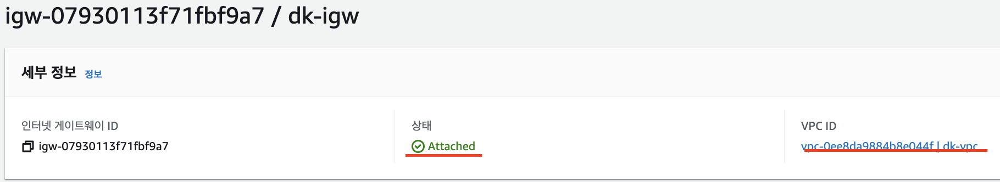

# VPC 구성

## 1. VPC 생성


- vpc만 사용 -> subnet은 추후 생성
- ipv4 CIDR 생성
    - https://ko.rakko.tools/tools/27/
- 태넌시
    - 태넌시를 활성화 하면 -> 내부 하드웨어에서 사용함

## 2. Subnet 생성

- public, private 생성
- vpc 자체가 가용한 트래픽 (10.0.255.255)
- public subnet 허용 트래픽 (10.0.0.255)
- private subnet 허용 트래픽 (10.0.1.255)
    

## 3. Internet GateWay 생성

- igw 생성시 -> 해당 vpc가 없기 때문에 Detached 상태임


    - Internet GateWay랑 Subnet이랑 연결
- 편집 부분에서 vpc를 할당해줘야 Attached 상태가 됨

## 4. Routing Table

- 라우팅 테이블 이름 생성 후 -> vpc 연결


- vpc 연결을 진행하지만 서브넷이 연결되지 않음 
- public rt -> public subnet
- private rt -> private subnet


- 해당 routing table에서 서브넷 연결


- public rt -> public subnet
- private rt -> private subnet (명시적으로 연결됨)

## 5. Routing Table Dest 지정해주기

- public routing table 생성
- private는 외부연결을 하지 않으니 -> 만들어줄 필요없음

## 6. NACL 구성

- NACL 설정을 진행한다 
- public-NACL
- private-NACL


## 7. NACL-inboud

- 22(SSH), 80(HTTP), 443(HTTPS) 포트를 허용한다
- 규칙번호는 순서 100 -> 200 -> 300 번 Order

## 8. NACL-outbound

- response는 임시포트로 전달이 되기때문에 모든 임시포트번호를 허용해준다. (outbound)

## 9. NACL과 Security Group의 차이점 (Stateful vs StateLess)

- NACL

```
    Stateless
    NACL은 해당 규칙내에서만 움직인다 -> 보안이 더 좋음
```

- Security Group

```
    Stateful
    상태를 저장하기 때문에, inbound, outbound가 state에 저장이 되어있다면 통과된다 -> 보안에 취약
```

## 10. Bastion Host
- 외부에서 private으로 연결을 진행할때


- public ec2, private ec2 두개를 만들고
- private ec2는 public ec2에서만 허용하게끔 설정한다


## 11. NAT Gateway

- net-gateway는 public에 위치하여 private subnet을 위해 우회하여야 한다
- 탄력적 ip를 이용


- private subnet routing table에 전체 ip 주소를 net-gateway로 연결한다

## 12. VPC Endpoint
- ...
