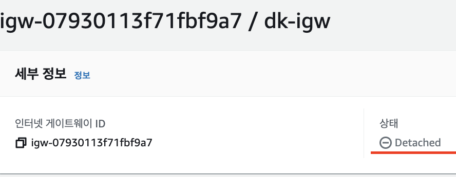

## VPC 구성

### 1. VPC 생성

- vpc만 사용 -> subnet은 추후 생성
- ipv4 CIDR 생성
    - https://ko.rakko.tools/tools/27/
- 태넌시
    - 태넌시를 활성화 하면 -> 내부 하드웨어에서 사용함

### 2. Subnet 생성

- public, private 생성
- vpc 자체가 가용한 트래픽 (10.0.255.255)
- public subnet 허용 트래픽 (10.0.0.255)
- private subnet 허용 트래픽 (10.0.1.255)
    

### 3. Internet GateWay 생성

- igw 생성시 -> 해당 vpc가 없기 때문에 Detached 상태임

    - Internet GateWay랑 Subnet이랑 연결
- 편집 부분에서 vpc를 할당해줘야 Attached 상태가 됨

### 4. Routing Table

- 라우팅 테이블 이름 생성 후 -> vpc 연결

- vpc 연결을 진행하지만 서브넷이 연결되지 않음 
- public rt -> public subnet
- private rt -> private subnet

- 해당 routing table에서 서브넷 연결

- public rt -> public subnet
- private rt -> private subnet (명시적으로 연결됨)

### 5. Routing Table Dest 지정해주기

- public routing table 생성
- private는 외부연결을 하지 않으니 -> 만들어줄 필요없음