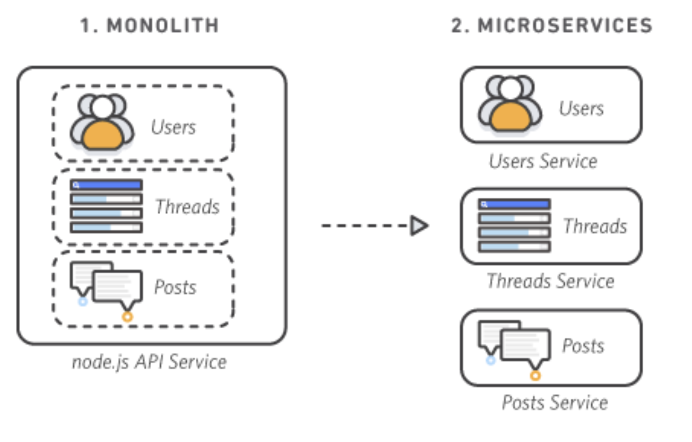

## 소규모 환경

### Monolithic Architecture vs MicroService Architecture

- Monolithic
```
    - 모든기능읋 한 부분에서 구현한다.
    - 실제로 앱이 구동되는 시작부터 ~ 끝까지 확인하기 좋다
    - 간단한 서비스를 구동하기에 좋다
    - 약간의 수정사항이 전체를 다시 빌드하고 배포해야 한다 -> 유지보수가 힘듬
    - 모든 기능이 한 Repo 안에서 설정되기 때문에 한 언어만을 이용해서 개발을 진행해야 한다
```

- **MicronService
```
    - 다양한 기능들을 잘게 쪼개서 관리한다.
    - 각 enpoint 별로 개별되어 구현이 되어있기 때문에 유지보수가 용이하다
    - 각 함수마다 interaction을 지정해줘야 한다
    - 각 기능에 따라 언어를 선택 할 수 있다.
    - 모니터링이 힘들고 -> 모놀리식과 다르게 end-to-end test를 하기가 불편한다
```

- 초기 서비스를 빌드시 -> Monolithic
- 서비스의 고도화를 진행 시 -> MicroService
