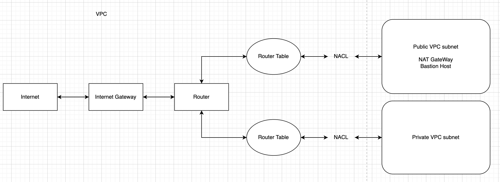

# VPC Architecture



## 용어정리
- vpc
    ```
        vpc는 public, private subnet으로 나뉘어진다.
        말 그대로 public vpc subnet은 외부와의 연결이 가능하고 
        private vpc subnet은 외부와의 연결이 불가능하다 
    ```
- NACL (Network Access Control List)
    ```
        해당 ip주소를 NACL 부분에서 Block 한다
    ```
- Router Table
    ```
        ip 주소의 이정표
        특정 ip주소의 대역폭의 대해서 Desctination을 지정해준다
    ```

- Private VPC Subnet
    - Desc
        - 외부와의 연결이 아닌 내부 연결에서만 동작한다
        - 회사 내부 DB나 보안에 중요한 부분이 해당 Subnet에서 동작한다
        - 외부와의 연결이 불가능한 이유는 해당 Router table에서 애초에 Dest가 Local로밖에 지정이 안되어있다.
        - Mysql, MariaDB, RDS ...

- Public VPC Subnet
    - Desc
        - 외부와의 연결이 가능하다
        - private vpc subnet에서 외부와의 연결을 진행할때 public 부분에서 우회를 진행한다

## Private VPC Subnet에서 외부와의 연결을 진행할 때

### 1. NAT Gateway
    - AWS 제공하는 NAT Gateway는 private subnet에서 외부와의 연결을 시도시 우회하는 방법이다
    ```
        private에서 외부연결 진행할 때
        private subnet -> NACL(private) -> Router table(private) -> Router -> 
        Router table(public) => NACL(public) -> public subnet(NAT GateWay) -> 
        NACL(public) -> Router table(public) -> Router -> Internet Gateway -> Internet

        외부연결이 다시 private 진행할 때
        - 위 case의 반대
    ```

### 2. Bastion Host
    - 외부에서 private subnet을 직접적으로 호출할때
    ```
        public subnet -> Bastion host -> private subnet
    ```

### 3. Gateway endpoint
    - private 외부와의 연결을 진행할때 public으로 우회하는것이 아닌 직접적으로 바로 전달한다
    ```
        private vpc subnet에서 aws s3서비스를 호출할 때

        private subnet -> NACL(private) => Router table(private) -> Router ->
        Gateway endpoint -> AWS S3 -> 반대도 동일
    ```